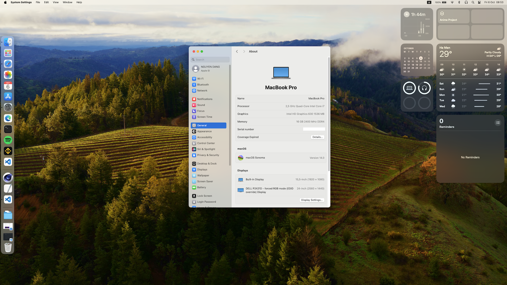

# MacOS for Asus FX553

## Instruction

1) Copy EFI folder from release zip to your EFI volume
2) Reboot, reset NVRam & Enjoy

## Hardware

<table>
  <thead>
    <tr>
      <th>Device</th>
      <th>Name</th>
      <th>Working</th>
    </tr>
  </thead>
  <tbody>
    <tr>
      <td>Processor</td>
      <td>Intel® Core™ i5 7300HQ Processor</td>
      <td>YES</td>
    </tr>
    <tr>
      <td>Chipset</td>
      <td>Intel® C230 Chipset</td> 
      <td>YES</td>
    </tr>
    <tr>
      <td>Memory</td>
      <td>DDR4 16GB 2400 MHz</td>
      <td>YES</td>
    </tr>
    <tr>
      <td>Graphic</td>
      <td>Intel® HD 630 1.5Gb</td>
      <td>YES</td>
    </tr>
    <tr>
      <td>Graphic</td>
      <td>Nvidia GeForce GTX 1050Ti 4Gb</td>
      <td><strong>UNSUPPORTED</strong></td>
    </tr>
    <tr>
      <td>Audio</td>
      <td>ALC233(235)</td>
      <td>YES</td>
    </tr>
    <tr>
      <td>Storage</td>
      <td>SSD SATA3, PCIE Gen3X4 SSD, Hard Drives</td>
      <td>YES</td>
    </tr>
    <tr>
      <td>Keyboard</td>
      <td>ASUS onboard</td>
      <td>YES</td>
    </tr>
    <tr>
      <td>Card Reader</td>
      <td>RTS5229 PCI Express</td>
      <td>NO</td>
    </tr>
    <tr>
      <td>WebCam</td>
      <td>ASUS onboard HD UVC</td>
      <td>YES</td>
    </tr>
    <tr>
      <td>Networking</td>
      <td>Realtek RTL8168H/8111H PCI Express Gigabit Ethernet</td>
      <td>YES</td>
    </tr>
    <tr>
      <td>WiFi</td>
      <td>Intel® AX200</td>
      <td>YES</td>
    </tr>
    <tr>
      <td>Bluetooth</td>
      <td>Intel® AX200</td>
      <td>YES</td>
    </tr>
    <tr>
      <td>Battery</td>
      <td>4 Cells Battery 3350mAh</td>
      <td>YES</td>
    </tr>
    <tr>
      <td>USB</td>
      <td>USB 3.0 Bus</td>
      <td>Testing</td>
    </tr>
    <tr>
      <td>HDMI</td>
      <td>Intel® HDMI HD 630</td>
      <td>YES</td>
    </tr>
    <tr>
      <td>Touchpad</td>
      <td>ELAN 1200</td>
      <td>YES</td>
    </tr>
     <tr>
      <td>Hibernation</td>
      <td>Sleep mode</td>
      <td>YES</td>
    </tr>
  </tbody>
</table>